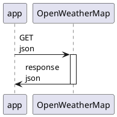

# get_daily_weather

- 天気をOpenWeatherMapから取得する処理についてまとめる
- 場所の情報は固定値で持つ
- したがって、appのhttpクライアントはOpenWeatherMapにリクエストを送るだけ

## シーケンス図

## request

## エンドポイント

- `5 days/3 hour forecast API`

### ヘッダ

|ヘッダキー|type|説明|必須|備考|
|----|----|----|----|----|
|X-RapidAPI-Host|string|ホスト|o||
|X-RapidAPI-Key|string|APIキー|o||

### 使うパラメータ

|キー|type|Value|備考|
|----|----|----|----|
|q|string|Hiroo,JP/Kawasaki,JP|2つの場所を取得する|
|units|string|metric||
|mode|string|json||
|cnt|string|5||
