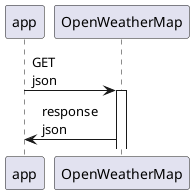

# get_daily_weather

- 天気をOpenWeatherMapから取得する処理についてまとめる
- 場所の情報は固定値で持つ
- したがって、appのhttpクライアントはOpenWeatherMapにリクエストを送るだけ

## シーケンス図

```plantuml
@startuml
participant app
participant OpenWeatherMap as owm
app -> owm: GET\njson
activate owm
owm -> app: response\njson
@enduml
```
